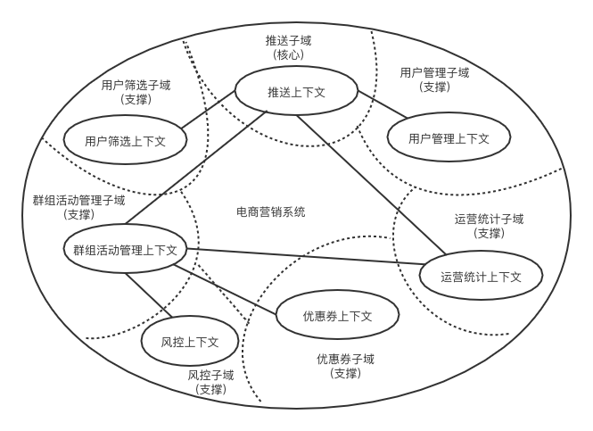

# 系统设计

## 前言

我们所有的系统本质都是对现实世界的建模，人类的大脑无法处理理解太复杂的模型，
从而需要我们通过分治法的方式进行系统设计完成建模。

## 问题

+ 什么是系统设计，系统设计的核心是什么？
+ 如何进行系统分析？
+ 如何进行业务建模？
+ 系统设计与架构设计
+ 如何进行架构设计？
+ 架构设计规范

### 什么是系统设计，系统设计的核心是什么

系统是一组实体与实体之间关系构成的集合，功能大于实体功能之和。而系统设计的核心是根据系统分析
的结果，运用系统科学的方法，确定划分实体之间的边界和连接，设计出最大限度满足要求的目标系统过程。

### 如何进行系统分析

系统分析是根据业务需求，按照多维度分析，形成业务模型和业务边界的系统过程。

| 维度    |  问题 | 定义 | 
|  ----  | ----  | ---- |
| 受众  | 谁使用这个系统 | 系统主体
| 利益  | 系统带来什么收益 | 系统价值
| 目标  | 系统短期目标和长远目标 | 系统定位
| 抽象  | 如何抽象系统 | 系统架构
| 需求  | 如何把需求转化业务模型 | 系统建模

#### 例子1 微服务框架

| 维度    |  问题 | 定义 | 
|  ----  | ----  | ---- |
| 受众  | 谁使用这个系统 | 部门后端程序员
| 利益  | 系统带来什么收益 | 后端程序员只面对业务，保证整体架构稳定可靠
| 目标  | 系统短期目标和长远目标 | 短期目标框架稳定，实现最基础常用的组件  长远目标尽可能集成通用组件
| 抽象  | 如何抽象系统 | 输出系统架构
| 需求  | 如何把需求转化业务模型 | 微服务组件库  微服务框架组装器   微服务框架工具链

#### 例子2 电商营销系统

| 维度    |  问题 | 定义 | 
|  ----  | ----  | ---- |
| 受众  | 谁使用这个系统 | ToB 商家，运营人员
| 利益  | 系统带来什么收益 | 商家通过营销系统可以针对性营销，增加回购率
| 目标  | 系统短期目标和长远目标 | 短期目标 按照条件筛选客户推送优惠券  长远目标 用户画像 商品推荐，优惠券推荐等
| 抽象  | 如何抽象系统 | 输出业务架构，系统架构
| 需求  | 如何把需求转化业务模型 | 用户筛选管理  优惠券推送   优惠券使用反馈

#### 例子3 医院结算系统

### 如何进行业务建模

业务建模是把需求转化成业务模型的过程，我们通过分析需求，理解需求，挖掘需求最后达成一个短期甚至长期
业务模型。在这个过程中我们需要:
+ 了解需求领域
+ 确定业务目标
+ 发现受众，确定收益
+ 划分系统边界，确定系统交互
+ 拆分业务需求，划分优先级，聚焦核心业务，确定资源评估
+ 输出业务模型
+ 抽象业务模型，设计系统架构

#### 业务建模方法

+ 用例驱动

> 用例驱动是一种自顶向下的方式，先定义出期望的场景，然后要求系统设计满足场景需求。
用例通过提供多个场景展示系统如何与用户进行交互，从而明确业务目标，在这个过程与任何技术细节无关
+ 领域驱动

> 领域驱动则是一种自底向上的设计方式，先与相关的领域专家请教相关的领域信息，在根据领域信息划分
核心领域，通用领域，支撑领域，在根据划分的领域进行重构贴近业务目标，

在实际开发过程需要两者结合考虑建模，输出业务架构。

#### 例子1 微服务框架

部门开发面临的痛点：
+ 时间紧、任务多、团队大、业务增长快，如何还能保证架构稳定可靠?
+ 研发水平参差不齐、项目压力自顾不暇，如何保证质量基线不被突破?
+ 公司有各种工具平台、SDK、最佳实践，如何尽可能的在业务中使用?

领域驱动步骤:
+ 收集部门目前使用的中间件，开源库，公司内部的基础组件，与一线开发交流，明确痛点需求

> 一线开发痛点
> + 所有基础组件开源都是直接用裸的（不同组组件选型不一致难以复用）
> + 每次使用都需要处理一大堆初始化，需要管理组件生命周期
> + 大量重复的类似代码

+ 确定目标，划分领域（核心领域 微服务组件库，支撑领域 微服务组装器， 工具链）

> 确定目标
> + 完全屏蔽业务无关的通用技术细节
> + 框架负责隔离组件底层与业务联系（重新抽象组件接口）
> + 框架维护组件生命周期管理(组装器负责管理初始化组件)
> + 框架与业务正交
> + 框架提供工具链，方便业务使用（通用代码生成器等）

+ 拆分需求，确定优先级（优先封装哪些组件，保证框架稳定）
> 确定需求优先级 
> + 组件库封装 > 组装器 > 工具链
> + 组件封装 (db, transport, log, redis, registry， broker， metrics) > (distLock, Distributed Tracing, hystrix)
+ 输出领域业务模型

#### 例子2 电商营销系统

领域驱动步骤:
+ 与产品讨论营销系统受众，目标，明确需求
> + 受众: ToB商家，运营人员
> + 目标: 针对性的筛选用户，通过推送优惠券，可能感兴趣的商品信息等行为提升销量
> + 需求: 筛选用户，推送优惠券，商品信息，运营统计（长期目标 用户画像，自动推送感兴趣信息）
+ 确定目标，划分领域

短期目标:
> + 用户筛选
> + 筛选出来的用户可执行多个推送活动
> + 商品信息推送，优惠券推送
> + 运营统计 优惠券使用订单反馈
> + 避免用户过度骚扰，需要控制发送次数

长期目标：
> + 用户画像
> + 短信推送，图片推送，多手段触达
> + 运营统计 复购率反馈，多方式展示（报表），多手段通知相关人员（商家，运营人员）

划分领域
> + 核心领域（推送领域，用户筛选领域，运营统计领域）
> + 支撑领域 (用户管理领域，群组活动管理领域，风控领域)

+ 输出领域业务模型

 

### 系统设计与架构设计

### 如何架构设计

### 架构设计规范