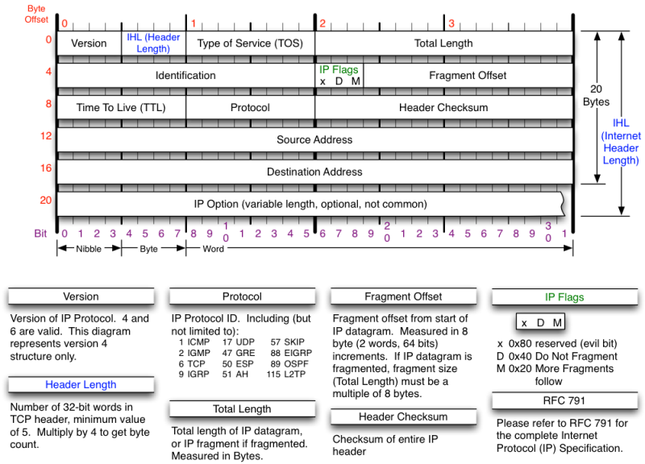
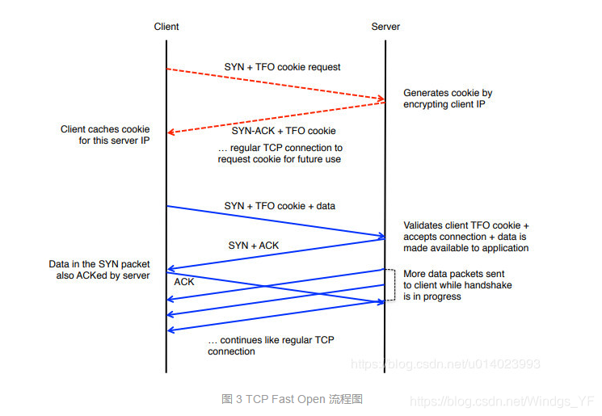
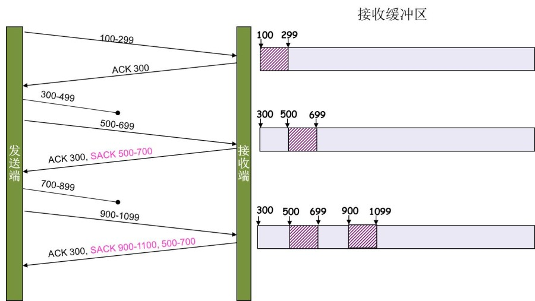

# 从TCP说起

## TCP 协议简介

TCP 全称Transmission Control Protocol， RFC793详细的说明TCP协议设计的目的和细节。
TCP 协议的目的是提供一个可靠，高可用的端到端协议。

## TCP 设计

我们先考虑下假如我们需要设计一个可靠，高可用的端到端协议，而网络不可靠，底层协议不可靠
我们会面对哪些问题:

+ 如何确保对端可靠收到消息 
    - 对端确认消息机制（对端支持消息确认，才能做到推送可靠）
    - 发送端重发机制 （对端没有收到需要重传）
    - 重传过滤 （网络不可靠，假如对端收到消息，发送端没有收到确认发起重传，对端需要识别）
   
+ 如何建立可靠连接
    - 五元组+序列号标示（序列号尽量保证唯一）
    - 对端确认连接机制
                                     
+ 如何正常断开连接
    - 对端消息确认机制
    
### 对端确认消息机制

最简单的做法每次收到数据包回复一个收到(ack)
### 发送端重发机制

+ 消息太大如何发送
    - 消息分片
+ 如何识别需要重发的消息（消息片）
    - 设置一个超时时间，超过超时时间还没收到ack，发起消息重发
    - ack携带分片信息

### 重传过滤

最简单做法，服务端收到数据包后发现不连续先缓存起来，等待发送端重传，记录所有分片信息，发现重传了已经收到的消息直接过滤

### 如何建立可靠连接

序列号需要满足两个特点:
+ 单调递增（识别数据包，支持重发过滤机制）
+ 安全难以模拟

序列号如何生成
+ 固定数字 缺点：不满足安全（可以构造tcp的数据包），
    连接可能发生串包（发送数据包网络延迟，连接断开重新连接，延迟数据包到达）
+ 时间戳 缺点： 不满足安全（可以猜时间戳）
+ 随机数 缺点：不满足单调递增 
+ 时间戳+无法猜测的数

对端确认连接机制:
+ 对端收到连接请求后回复ack，确认连接建立（缺点：底层网络不可靠，无法识别老连接，服务端信息不足）
+ 对端收到连接请求后回复ack，发送端确认连接建立，通知对端

### 如何断开

TCP是一个端到端全双工协议，客户端与服务端建立连接后是各自独立，两边都可以发起断开请求，存在以下场景:
+ 发送端发起断开，服务端收到后被动应答，断开
+ 服务端发起断开，发送端被动应答断开
+ 双方主动发起断开连接

假如是我们设计可靠的端到端协议，以上大概是能想到的场景和解决方案。上面的设计还缺少很多方面考虑（安全，性能，流控...）

接下来我们看下RFC 是怎么规范TCP协议的

## RFC与TCP

 

TCP 头设计

### 如何建立可靠连接

 

#### ISN 生成

RFC793 说明了ISN的生成 The generator is bound to a (possibly fictitious) 32 bit clock 
whose low order bit is incremented roughly every 4
microseconds.  Thus, the ISN cycles approximately every 4.55 hours.

ISN会和一个假的时钟绑在一起，这个时钟会在每4微秒对ISN做加一操作，直到超过2^32，又从0开始。
这样，一个ISN的周期大约是4.55个小时。我们假设我们的TCP Segment在网络上的存活时间不会超过MSL

更进一步RFC1948 设计了新的算法
ISN = M + F (Sip, Sport, Dip, Dport, <Some Secret>)

F：单向散列哈希函数
<Some Secret>：哈希函数可选部分，使远程攻击者更难猜到ISN。
其他不解释了

#### RFC793 建立连接
RFC793说明了为什么需要3次握手 The principle reason for the three-way handshake is to prevent old
 duplicate connection initiations from causing confusion. 

3次握手主要目的就是协商ISN，通信的双方要互相通知对方自己的初始化的Sequence Number，这样可以保证
在网络乱序情况下协议可以通过这个SN，还原发送端的数据包。假如两次的话服务端无法区分老的连接（信息不足）

#### RFC 7413 建立连接

 
3次握手性能一般（特别是在弱网环境下），Google研究发现TCP三次握手是页面延迟时间的重要组成部分，所以他们提出了
TFO：在TCP握手期间交换数据，这样可以减少一次RTT。

### 发送端重发机制

#### RFC 793重传机制

发送端需要维护最大连续确认ack，比如，发送端发了1,2,3,4,5一共五份数据，接收端收到了1，2，于是回ack 3，然后收到了4（注意此时3没收到）
超过一定时间后发送端只知道目前对端收到的最大包为3， 可以选择两种重传:
+ 仅重传timeout的包。也就是第3份数据。（优点：节省带宽，缺点：可能需要多次重传）
+ 重传timeout后所有的数据，也就是第3，4，5这三份数据。（优缺点与上面相反）

#### RFC 2581 重传机制（Fast Retransmit）

 

2581 引入快速重传机制，包没有连续到达，就ack最后那个可能被丢了的包，如果发送方连续收到3次相同的ack，就重传。避免了等到超时在重传。
Fast Retransmit 解决了超时等待问题，但是无法解决到底传输什么包问题。

#### RFC 2018  重传机制（Selective Acknowledgment）

 

2018 利用了tcp协议option，加入了一个SACK的东西，保存收到的不连续数据碎版。在发送端就可以根据回传的SACK
就知道需要重传哪些数据。（内核的之前的实现有坑，爆出过漏洞 CVE-2019-11477 SACK Panic）

### 流控机制

### 参考资料:

https://tools.ietf.org/html/rfc793

https://tools.ietf.org/html/rfc2581

https://tools.ietf.org/html/rfc7413

http://static.googleusercontent.com/media/research.google.com/zh-CN/us/pubs/archive/37517.pdf